# Cereus Data Sync — Help

Cereus Data Sync keeps Cacti in step with a device inventory spreadsheet. Every run
adds new devices, updates changed ones, tags removed ones for deletion, creates
their graphs and files them into the graph tree by location.

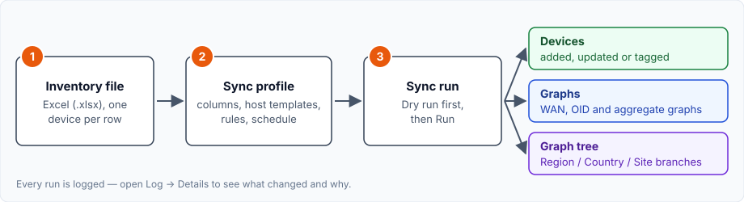

The numbered markers on the screenshots below match the numbered steps under each
one. This guide covers version 1.7.1.

---

## Contents

1. [Requirements and installation](#1-requirements-and-installation)
2. [Quick start](#2-quick-start)
3. [The inventory file](#3-the-inventory-file)
4. [Sync profiles](#4-sync-profiles)
5. [Running a sync](#5-running-a-sync)
6. [What a sync does to your devices](#6-what-a-sync-does-to-your-devices)
7. [Tree placement rules](#7-tree-placement-rules)
8. [Aggregate graph rules](#8-aggregate-graph-rules)
9. [OID graph rules](#9-oid-graph-rules)
10. [Cleaning up empty sites and branches](#10-cleaning-up-empty-sites-and-branches)
11. [Licensing](#11-licensing)
12. [Troubleshooting](#12-troubleshooting)

---

## 1. Requirements and installation

| You need | |
|---|---|
| Cacti | 1.2.0 or newer |
| PHP | 7.4 or newer, with the `zip` and `xml` extensions |
| Licence | Cereus License Manager plugin, Professional or Enterprise |

The plugin brings everything else with it (`vendor/`, `lib/sync/`); nothing is
needed in Cacti's `cli/` directory.

**Install**

1. Copy the plugin directory to `<cacti>/plugins/cereus_datasync/` — including
   `vendor/`, `lib/sync/` and `docs/`.
2. **Console → Configuration → Plugins**: install and enable **Cereus Data Sync**.
3. Give the **Plugin: Cereus Data Sync** permission to the users who manage syncs.
4. Open **Console → Data Sync**.

**Upgrade:** replace the plugin directory and open **Console → Data Sync** once. The
plugin notices the new version and upgrades itself.

---

## 2. Quick start

From spreadsheet to a filled graph tree:

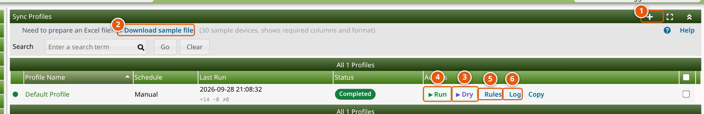

1. **Create a profile** with **+**. Set the file's location and its columns, map each
   device function to a host template ([section 4](#4-sync-profiles)), and save.
2. No inventory file yet? **Download sample file** — 30 example devices with every
   column the sync reads.
3. **Dry** — a dry run changes nothing; it only reports what a real run would do.
4. **Run** — makes the changes.
5. **Rules** — place graphs in the tree automatically ([section 7](#7-tree-placement-rules)).
6. **Log** — the report of every run ([section 5](#5-running-a-sync)).

> **Tip:** always do a dry run after changing the file layout or the mapping.

---

## 3. The inventory file

One worksheet, one device per row. You tell the profile which column holds which
field, so the file can keep your own layout.

| Field | What it is used for |
|---|---|
| Device Description | The device's name in Cacti |
| Hostname / IP Address | The address Cacti polls |
| SNMP Community | SNMP v1/v2c community (falls back to the profile default) |
| Device Function | The device's role — picks the Cacti host template |
| Region | Location, level 1 — e.g. `Europe` |
| Country | Location, level 2 — e.g. `Germany` |
| Site | Location, level 3 — e.g. `Munich - Head Office`; also the device's location text |

Region, Country and Site together make the **location**. The sync creates one Cacti
site per location (named `Region/Country/Site`) and builds the tree branches from it.

Rows with neither a hostname nor an IP address are skipped and listed as
*Dropped* in the run report.

---

## 4. Sync profiles

A profile is one inventory source with its settings. Open it by clicking its name in
the profile list. You can keep several — one per region or customer, for example.

### Where the file is and which column is which

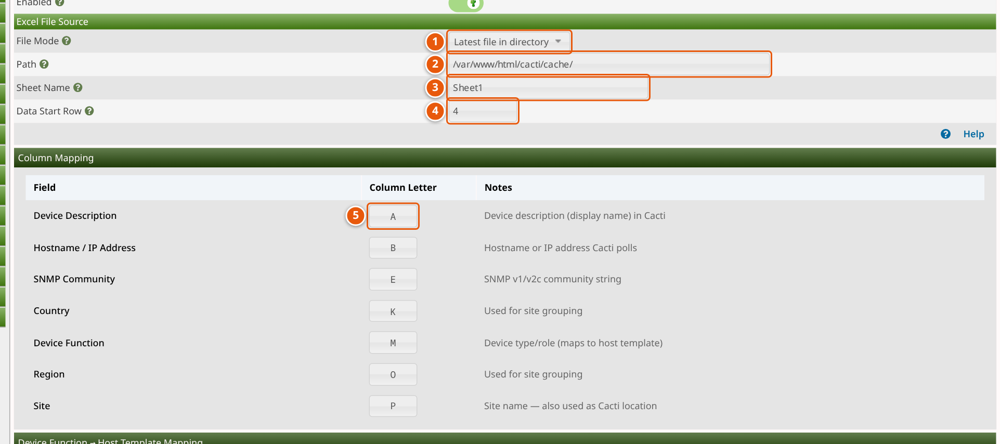

1. **File Mode** — *Specific file path* reads one file; *Latest file in directory*
   takes the newest `.xlsx` in a folder, so a nightly export can simply be dropped
   there.
2. **Path** — the file, or the folder for *Latest file in directory*.
3. **Sheet Name** — the worksheet tab to read.
4. **Data Start Row** — the first row with devices (e.g. `4` when rows 1–3 are
   headers).
5. **Column Letter** — for every field, the column it is in (`A`, `B`, …).

### Which host template each device gets

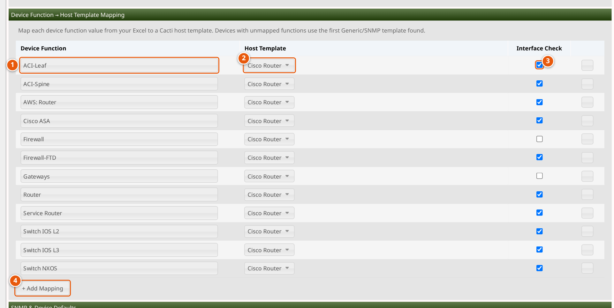

1. **Device Function** — a value from your file's *Device Function* column.
2. **Host Template** — the Cacti host template for devices with that function.
3. **Interface Check** — tick to check these devices over SNMP before adding them:
   only devices with an interface matching the *Interface Pattern* (for example
   `-WAN-`) are added.
4. **+ Add Mapping** — one row per function in your file. Devices whose function has
   no row are skipped and logged.

### What happens to removed devices, and what gets created

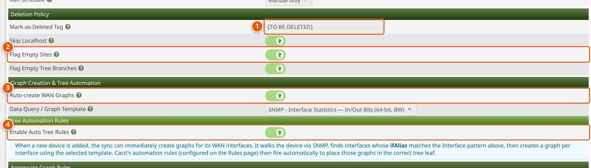

1. **Mark-as-Deleted Tag** — put in front of the name of a device that is no longer in
   the file. Devices are never deleted automatically.
2. **Flag Empty Sites** / **Flag Empty Tree Branches** — tag sites and branches left
   without devices ([section 10](#10-cleaning-up-empty-sites-and-branches)).
3. **Auto-create WAN Graphs** — create a graph for each WAN interface of a new
   device, using the *Data Query / Graph Template* below it.
4. **Enable Auto Tree Rules** — turn on the tree rules of
   [section 7](#7-tree-placement-rules).

**Other settings on this page**

| Section | Settings |
|---|---|
| Interface checks | Interface pattern, SNMP timeout, parallel workers (10–20 is a good range) |
| SNMP & Device Defaults | SNMP version, community, port, timeout, availability and ping method, poller |
| Schedule | *Manual*, *Every poller cycle*, *Hourly*, *Daily* or *Weekly* — scheduled runs need Enterprise |

To start a new profile from an existing one, use **Copy** in the profile list.

---

## 5. Running a sync

**Dry** reports what would change, **Run** makes the changes. Both run in the
background; the page stays usable and updates on its own.

### The sync log

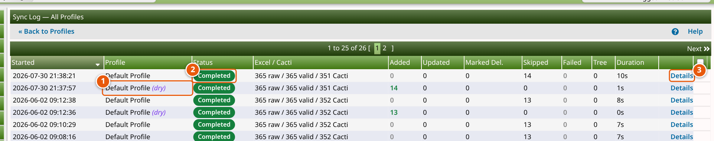

1. Dry runs are marked *(dry)*.
2. **Status** — *Queued*, *Running*, *Completed* or *Failed*.
3. **Details** — the full report of that run.

A run that cannot start at all (for example because a library is missing) ends as
**Failed** with the reason — it never stays *Queued*.

### The run report

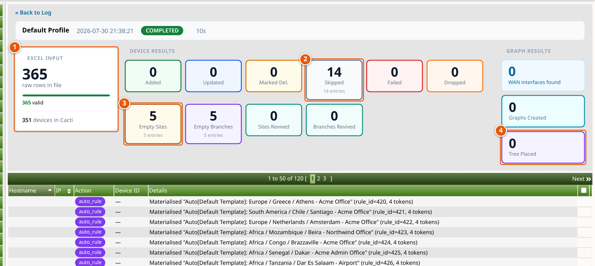

1. **Excel input** — rows in the file, valid rows, devices in Cacti.
2. **Device results** — added, updated, marked for deletion, **skipped**, failed,
   dropped. Click a box to list just those devices and the reason.
3. **Cleanup** — sites and branches flagged as empty, or revived.
4. **Graph results** — WAN interfaces found, graphs created, tree placements.

Below the boxes: one line per action, with the device and the reason. Export it as
CSV, or remove old runs with **Purge Log**.

---

## 6. What a sync does to your devices

| The device… | The sync… |
|---|---|
| is in the file, not in Cacti | **adds** it — host template, SNMP defaults, site |
| changed name, location or site | **updates** it and adds a dated line to its Notes |
| is in Cacti, no longer in the file | **tags** it: `[TO BE DELETED] <name>` |
| is unchanged | leaves it alone |

- **Graph titles follow the device.** When a device is tagged, renamed or moved,
  its graph titles are refreshed too — search for the tag to find its graphs.
- **One site per location.** A site flagged as empty by an earlier run is reused
  when devices return, never duplicated.

---

## 7. Tree placement rules

**Rules → Tree Placement Rules.** A *rule template* is written once; the sync turns it
into a Cacti tree rule for every location in the file. From then on, Cacti puts each
new graph in the right branch the moment it is created.

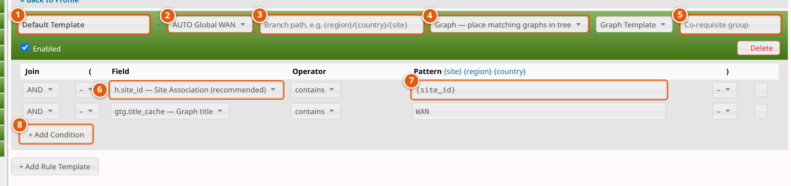

1. **Name** — the generated rules are called `Auto[<name>]: <branch>`.
2. **Tree** — the graph tree to place into.
3. **Branch path** — where in the tree (see below). Blank = Region / Country / Site.
4. **Leaf type** — *Graph* places matching graphs; *Host* places the device itself.
5. **Co-requisite group** — optional, see below.
6. **Field** — what to test (list below).
7. **Pattern** — the value to look for; placeholders are filled in per location.
8. **+ Add Condition** — add more conditions, joined with **AND** / **OR**, grouped
   with the **(** and **)** columns.

**Result:** the branches build themselves as devices arrive.

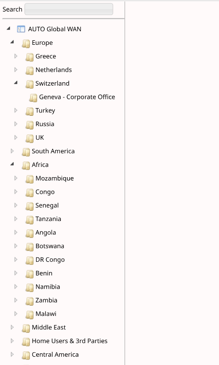

### Fields and placeholders

| Field | Tests | | Placeholder | Becomes |
|---|---|---|---|---|
| `h.site_id` | the device's site (**recommended**) | | `{site_id}` | the location's site ID |
| `h.location` | location text (40 characters) | | `{site}` | site name (40 characters) |
| `h.description` | device name | | `{region}` | region |
| `h.hostname` | device address | | `{country}` | country |
| `ht.name` / `gt.name` | host / graph template | | | |
| `gtg.title_cache` | graph title | | | |

The usual per-site rule is **`h.site_id` contains `{site_id}`** plus a condition on the
graph title, as in the screenshot. With AND / OR and parentheses you can go further:

```
h.site_id equals {site_id}
AND ( gtg.title_cache contains "WAN" OR gtg.title_cache contains "Internet" )
```

Every **(** needs its **)** — otherwise the template is skipped and the log says so.

### Branch paths

| Branch path | Where graphs go |
|---|---|
| *(blank)* or `{region}/{country}/{site}` | `Europe / Germany / Munich - Head Office` |
| `{region}/{country}` | one branch per country |
| `Internet/{region}` | a collector branch per region |
| `EMEA/Germany/Munich` | always this fixed branch |

- Missing branches are **created during the run**.
- A level whose placeholder is empty for a location is left out.
- Write `\/` for a slash inside one header name (`Plant A\/B`).
- Locations landing on the same branch with the same conditions **share one rule**.

### Co-requisite groups — "only if the other one is there too"

Give two or more graph templates the same **Co-requisite group** name. At each
location they are placed **only when every template in the group matches at least
one graph there** — otherwise nothing of the group is placed and no branch is created.

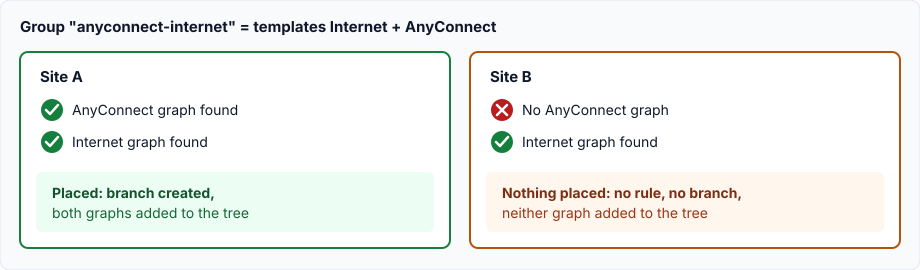

- Graphs created in the same run count.
- When a group stops matching, its rules and placements from earlier runs are removed.
- The log has one line per group and site, naming the template that had no graph.

---

## 8. Aggregate graph rules

**Rules → Aggregate Graph Rules.** One combined graph per rule, built from all graphs
that match it — rebuilt on every run, so new members join automatically.

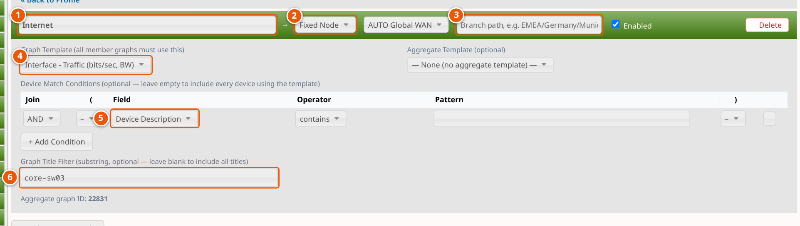

1. **Name** of the aggregate graph.
2. **Placement** — *Fixed Node* uses the branch path (3); *Site* places it under a
   site's header.
3. **Branch path** — created if missing, as for tree rules.
4. **Graph Template** — every member graph must use it.
5. **Device Match Conditions** — which devices take part (AND / OR, parentheses).
   Leave empty for all devices using the template.
6. **Graph Title Filter** — optional text the member graph titles must contain.

---

## 9. OID graph rules

**Rules → OID Graph Rules.** One graph per matching device for a single SNMP value
that has no data query — a session count, a temperature, a CPU counter.

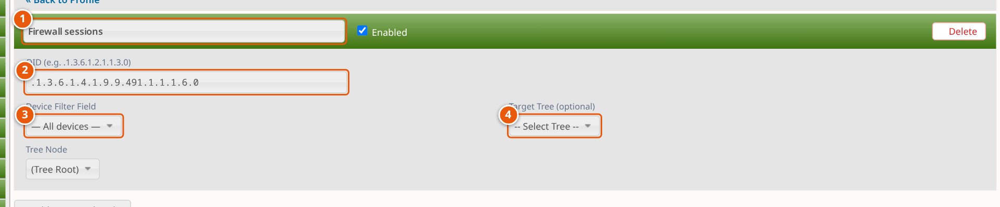

1. **Name** of the rule; the graph title can use Cacti placeholders such as
   `|host_description|`.
2. **OID** to poll, e.g. `.1.3.6.1.4.1.9.9.491.1.1.1.6.0`.
3. **Device Filter Field** and pattern — which devices get the graph (*All devices*
   for every one).
4. **Target Tree** — optional tree and node for the new graphs.

A device that already has a graph for the OID is skipped.

---

## 10. Cleaning up empty sites and branches

The sync never deletes anything. Instead it **flags**:

| Setting | After each run |
|---|---|
| Flag Empty Sites | sites without live devices get the deletion tag in front of their name |
| Flag Empty Tree Branches | the top header of each branch without live devices is tagged |

Devices come back? The next run reuses the flagged site or branch and removes the tag.

**Removing them together with devices:** when you delete devices under
**Console → Management → Devices**, the confirmation page offers an extra option to
also remove the sites and tree branches this leaves empty. Anything still holding a
live device is left alone.

---

## 11. Licensing

| | Professional | Enterprise |
|---|:---:|:---:|
| Sync profiles | 3 | unlimited |
| Tree rule templates per profile | 10 | unlimited |
| Scheduled (unattended) sync | — | ✓ |
| **Site licence, per year (EUR)** | **€899** | **€1,599** |

A site licence covers one organisation: unlimited Cacti installations and devices,
12 months of updates and support. Every licence starts with a 14-day free trial.

---

## 12. Troubleshooting

| You see | Do this |
|---|---|
| A run shows **Failed** | Open **Details** — the reason is at the top (also in `cacti.log`). |
| "PhpSpreadsheet vendor autoload not found" | `vendor/` is missing: copy the whole plugin directory, or run `composer install` in it. |
| "Composer detected issues in your platform" | The `vendor/` was built for a newer PHP. Use the one shipped with the plugin (PHP 7.4+). |
| Devices are **Skipped** | Details shows why: a device function without a host template, or no interface matching the pattern. |
| A template created no rule for a site | The log says why: no site for `{site_id}`, branch path empty, or unbalanced parentheses. |
| Graphs are not placed in the tree | Check **Enable Auto Tree Rules** in the profile, that the template is enabled, and that its conditions match the graph titles. For co-requisite groups, the log names the missing template. |
| A graph keeps an old device name | Its title refers to a data query index that no longer exists — re-index the device or recreate the graph. |

**Command line:** the background runner is
`php plugins/cereus_datasync/cereus_datasync_run.php --profile=<id> --run=<id> [--dry]`.
The web interface and the scheduler start it; you normally never call it yourself.
